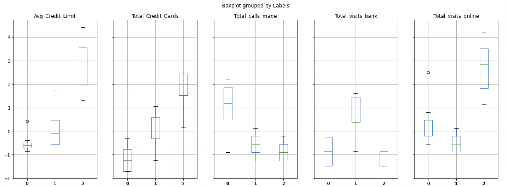
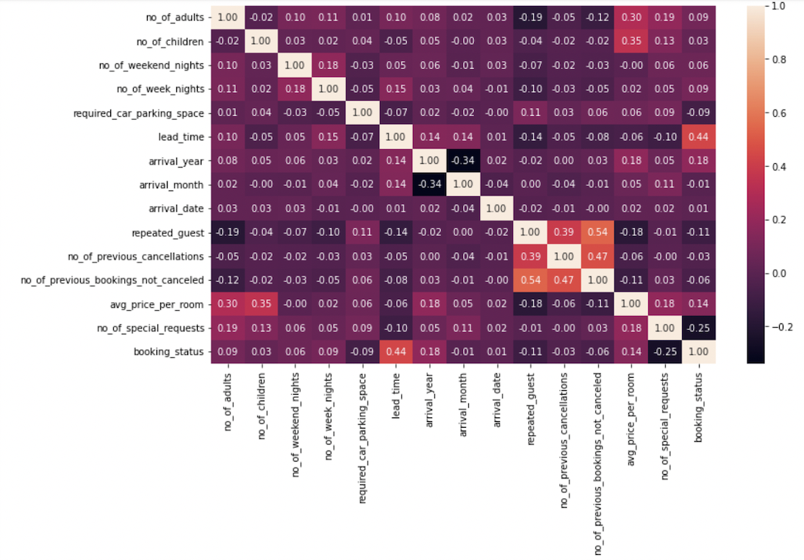
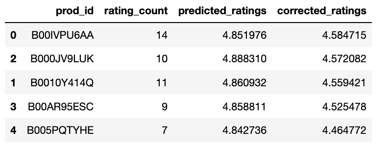
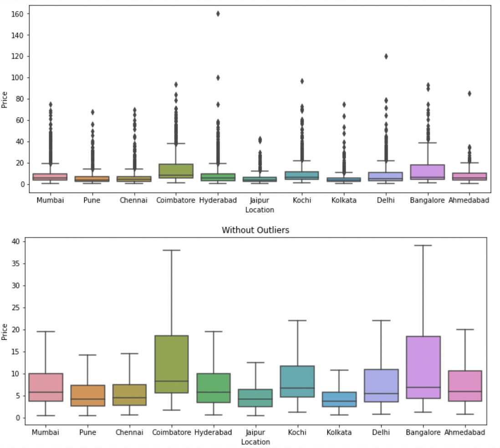

Hi there, welcome and thank you for visting my hub.

I've outlined couple of projects that I have worked on over the course of my Data Science journey. I am always learning and will try to showcase the most relevant projects. 

# [Project 1: Bank Customer Clustering](https://github.com/arakibit/portfolio/tree/main/Data%20Science/Projects/Bank_CreditCard_Analysis)
* Needed to segment bank customers to help the bank upgrade the service delivery model and ensure that customers queries are resolved more efficiently
* Brought in libraries: Pandas, Matplotlib, Numpy and Sklearn to perform EDA in removing duplicates and data that does not add value to the analysis along with clustering to identify customer groups to draw business actions
* Identified key customer groups that would respond better when responding through phone, online, and/or visiting the bank 

# [Project 2: Cancellation of hotel bookings](https://github.com/arakibit/portfolio/tree/main/Data%20Science/Projects/Predicting_Hotel_Cancellation_Rates)
* Involves predicting booking cancellations based on booking details and helping formulate profitable policies for cancellations and refunds.
* The cancellation of bookings impact a hotel on various fronts: loss of revenue when the hotel cannot resell the room, additional costs of distribution channels by increasing commissions or paying for publicity to help sell these rooms, and lowering prices last minute so the hotel can resell a room, resulting in reducing the profit margin.
* Used Linear Regression, Logistic Regression, kNN
* Recommended the client to place stricter cancellation policies for last minute cancellations and up-sell meal plans in advance that was a good indicator to for customers who did not cancel

# [Project 3: Amazon Product Recommendation System](https://github.com/arakibit/portfolio/tree/main/Data%20Science/Projects/Amazon_Recommendation_System)
* This project involves recommending the best amazon products available to the users by using some recommendation systems techniques.
* Used Rank Based Recommendation Systems, Similarity Based Recommendation Systems, Matrix Factorization Based Recommendation Systems
* Created model to recommend five different products to a customer with certain characteristics 

# [Project 4: Predicting Used Car Prices](https://github.com/arakibit/portfolio/tree/main/Data%20Science/Projects/Predicting_UsedCar_Prices)
* Used linear regression, ridge/lasso regression, decision trees, random forest to compare across different models and identify best performing model
* Linear regression performed the best out of the other models
* Recommended ways to improve model accuracy (e.g. collecting data more relevant to purchasers)

